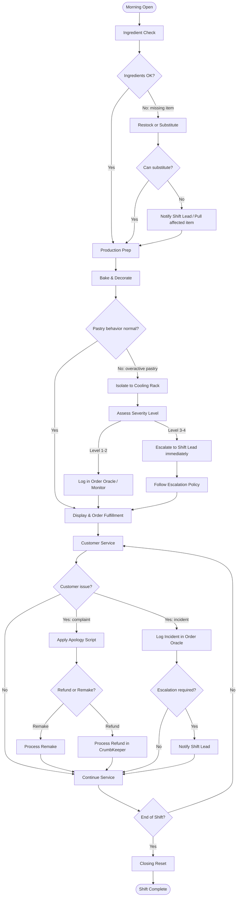

# Bakery Operations Process Map

This map shows the high-level flow of a standard bakery operations day. Use it for orientation, training, and process improvement discussions.

For step-by-step instructions, follow the linked procedures.

---

## End-to-End Operations Flowchart

---

## Key Decision Points

| Decision Point | Trigger | Go To |
|---|---|---|
| Missing ingredient | Ingredient not in stock at open | [`restock-magical-ingredients.md`](procedures/restock-magical-ingredients.md) or [`ingredient-substitution-table.md`](job-aids/ingredient-substitution-table.md) |
| Overactive pastry | Unexpected behavior during or after baking | [`handle-overactive-pastry.md`](procedures/handle-overactive-pastry.md) |
| Customer complaint | Customer reports issue at counter | [`customer-apology-scripts.md`](job-aids/customer-apology-scripts.md) |
| Refund request | Customer wants money back | [`process-customer-refund.md`](procedures/process-customer-refund.md) |
| Remake request | Customer wants replacement product | [`refund-and-remake-policy.md`](policies/refund-and-remake-policy.md) |
| Escalation trigger | Level 3+ pastry, injury, or major complaint | [`customer-incident-escalation-policy.md`](policies/customer-incident-escalation-policy.md) |

---

## Linked Procedures by Phase

| Phase | Primary Procedure |
|---|---|
| Morning Open | [`procedures/open-morning-bakery.md`](procedures/open-morning-bakery.md) |
| Ingredient Check | [`procedures/restock-magical-ingredients.md`](procedures/restock-magical-ingredients.md) |
| Production | [`procedures/prepare-whispering-sourdough.md`](procedures/prepare-whispering-sourdough.md), [`procedures/prepare-dragon-pepper-rolls.md`](procedures/prepare-dragon-pepper-rolls.md) |
| Bake & Decorate | [`procedures/decorate-singing-cake.md`](procedures/decorate-singing-cake.md) |
| Incident Handling | [`procedures/handle-overactive-pastry.md`](procedures/handle-overactive-pastry.md) |
| Refund | [`procedures/process-customer-refund.md`](procedures/process-customer-refund.md) |
| Closing Reset | [`procedures/close-evening-shift.md`](procedures/close-evening-shift.md) |
